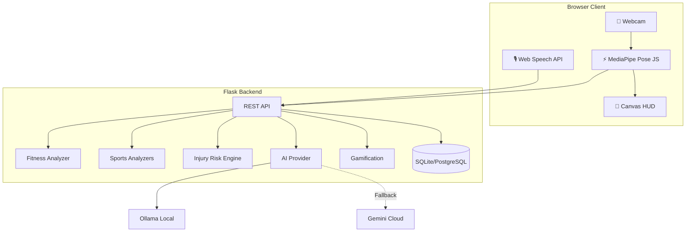

# Kinesis AI

## AI-Powered Movement Intelligence for Safer, Smarter Fitness

**Smart India Hackathon 2026 | PS ID: 26196 | Fitness & Sports Theme | Team INOVE8**

---

## Problem

Conventional fitness applications track steps, calories, and repetitions, but often fail to understand movement quality and form. This leads to:

- Poor exercise technique causing injuries
- Lack of real-time corrective feedback
- No personalized coaching based on individual biomechanics
- Sports athletes training without technical guidance
- Yoga practitioners practicing without alignment verification

## Solution

Kinesis AI transforms any webcam into an intelligent movement coach using computer vision and AI. The system:

1. **Captures** real-time movement via webcam at 30 FPS
2. **Analyzes** 33 body landmarks using MediaPipe Pose
3. **Calculates** joint angles, symmetry, stability, and range of motion
4. **Detects** exercise repetitions with quality gating
5. **Scores** form in real-time (0-100 scale)
6. **Identifies** movement-risk indicators (non-medical)
7. **Provides** instant audio/visual feedback
8. **Generates** personalized training plans using AI
9. **Tracks** progress with gamification (XP, badges, levels)

## Core Innovation

**Movement Quality → Risk Detection → Personalized Intervention**

Unlike step-counters, Kinesis AI understands **how** you move, not just **how much** you move. The system:

- Uses deterministic biomechanical calculations (no AI inference during real-time analysis)
- Processes video locally on the client for privacy
- Employs AI only for coaching insights and training plan generation
- Maintains a clear boundary between movement-risk indicators and medical advice

## Key Features

### Currently Working Features

#### Real-Time Pose Estimation
- 33-point body landmark tracking via MediaPipe
- 30 FPS analysis on standard hardware
- Client-side processing for low latency

#### Fitness Exercise Analysis
- **Push-ups**: Elbow depth (90°), body alignment, symmetry
- **Squats**: Thigh parallel (80°-100°), knee-over-toe alignment, torso position
- **Lunges**: 90° knee flexion, back-knee clearance, spine stability
- **Planks**: Hold duration, core sag detection, stability score
- **Jumping Jacks**: Arm reach (>150°), leg spread cadence
- **Quality Rep Gating**: Only reps meeting biomechanical criteria count

#### Football Intelligence
- **Shooting Biomechanics**: Plant foot, knee flexion, hip rotation, torso lean, follow-through
- **Pose-Based Dribbling**: Center of mass shifts, directional pivots
- **Agility Drills**: Movement speed and direction changes
- **Style-Inspired Coaching**: Technical philosophies (e.g., Messi close-control)

#### Cricket Biomechanics
- **Pull Shot**: Back-foot weight transfer, hip rotation, head stability
- **Cover Drive**: Front-foot stride, head-over-ball alignment (Kohli mode)
- **Straight Drive**: Vertical bat presentation, high elbow drive
- **Batting Stance**: Base width, knee flexion, shoulder alignment
- **Bowling**: Run-up posture, front-leg brace, lumbar safety

#### Yoga Posture Analysis
- Warrior II, Tree Pose, Downward Dog, Cobra, Triangle, Mountain Pose
- Real-time alignment feedback
- Balance and stability scoring

#### Injury-Risk Engine
- Joint-angle deviation detection
- Left/right asymmetry analysis
- Range of motion monitoring
- Fatigue-related form deterioration
- Risk classification: Low/Moderate/High
- **Disclaimer**: "This is a movement-risk indicator, not a medical diagnosis."

#### AI-Powered Coaching
- **Ollama (Primary)**: Local inference for privacy
- **Gemini (Fallback)**: Cloud API when Ollama unavailable
- **Training Plans**: 4-week position-specific sports regimens
- **Diet Planning**: BMR/TDEE calculation with Indian nutrition options
- **Voice Coach**: Bilingual Hindi/English audio feedback

#### Gamification System
- XP rewards for quality reps (not just rep count)
- Badge unlocks (form milestones, streaks, sports exploration)
- Level progression with titles (Rookie → Legend)
- Daily streak tracking
- Leaderboard support

#### User Management
- Firebase-ready authentication (currently Flask-Login)
- User profiles with fitness level and sport preferences
- Workout and sports session history
- Dashboard with Chart.js visualizations

## System Architecture



## Core AI Pipeline

```
Webcam Video
    ↓
MediaPipe Pose Estimation
    ↓
33 Body Landmarks (x, y, z, visibility)
    ↓
Joint Angle Calculation
    ↓
Exercise State Machine
    ↓
Rep Detection & Quality Check
    ↓
Form Score (0-100)
    ↓
Movement-Risk Analysis
    ↓
AI Coaching Insight
    ↓
Feedback Display
```

## AI Architecture

### Why Both Ollama and Gemini?

**Ollama (Primary):**
- Local inference on user's machine
- Privacy: video frames never leave the device
- Offline capability when internet unavailable
- Lower recurring API costs
- Suitable for privacy-conscious users

**Gemini (Fallback):**
- Cloud-based when Ollama not installed
- Stronger general-purpose responses
- Availability when local model isn't running
- Backup for users without local GPU/CPU resources

**Flow:**
1. Try Ollama first (local, private)
2. If unavailable/error, fall back to Gemini
3. If both unavailable, provide safe fallback message
4. No video frames ever uploaded to cloud (only structured metrics)

## Technology Stack

| Component | Technology | Purpose |
|-----------|-----------|---------|
| **Frontend** | HTML5, JavaScript, Bootstrap 5.3 | Responsive UI |
| **Computer Vision** | MediaPipe Pose (JavaScript) | 33-point pose detection |
| **Backend** | Flask 3.1.1 | Web framework |
| **Database** | SQLAlchemy 2.0 (SQLite/PostgreSQL) | Data persistence |
| **Authentication** | Flask-Login 0.6.3 | User sessions |
| **AI - Local** | Ollama (gemma3:4b) | Privacy-first inference |
| **AI - Cloud** | Google Gemini 2.0 Flash | Fallback AI |
| **Math/Analysis** | NumPy 1.26.4 | Biomechanical calculations |
| **Video Processing** | OpenCV 4.10.0 | Image handling |
| **Visualization** | Chart.js | Dashboard analytics |
| **Voice** | Web Speech API | Bilingual voice coach |

## Installation

### Prerequisites
- Python 3.10 – 3.12
- Webcam (built-in or USB)
- Modern browser (Chrome/Edge recommended)
- *(Optional)* Ollama for local AI

### Windows Setup

1. **Clone the repository:**
```bash
git clone https://github.com/Divyansh0208/Kinesis_AI.git
cd Kinesis_AI
```

2. **Create virtual environment:**
```powershell
python -m venv venv
.\venv\Scripts\Activate.ps1
```

3. **Install dependencies:**
```bash
pip install -r requirements.txt
```

4. **Configure environment variables:**
```bash
copy .env.example .env
```

Edit `.env` with your settings:
```env
OLLAMA_BASE_URL=http://localhost:11434
OLLAMA_MODEL=gemma3:4b
GOOGLE_API_KEY=your_gemini_api_key_here
SESSION_SECRET=change-this-to-a-random-secret-key
DATABASE_URL=sqlite:///kinesis.db
```

5. **(Optional) Install Ollama for local AI:**
   - Download from https://ollama.com/download
   - Run: `ollama pull gemma3:4b`

## Running the Application

```bash
python run.py
```

Open http://localhost:5000 in your browser.

## Demo Workflow for Judges

### Quick Test (5 minutes)

1. **Register:** Create an account at `/register`
2. **Select Exercise:** Go to `/workout` and choose "Push-up"
3. **Calibrate:** Stand in front of camera, click "Start Camera"
4. **Perform:** Do 3-5 push-ups with good form
5. **Observe:** Watch real-time form score and rep counting
6. **Complete:** Click "Finish Session" to see results and XP earned

### Full Demo (10-15 minutes)

1. **Fitness Demo:** Try push-ups, squats, or lunges
2. **Sports Demo:** Test football shooting or cricket pull shot
3. **Yoga Demo:** Try Warrior II or Tree Pose
4. **Voice Coach:** Ask "How was my form?" in voice section
5. **Dashboard:** View workout history and progress charts
6. **AI Features:** Generate a training plan (requires Ollama or Gemini API key)

See [docs/JUDGE_DEMO.md](docs/JUDGE_DEMO.md) for detailed step-by-step instructions.

## Performance

| Metric | Target | Status |
|--------|--------|--------|
| Pose Detection FPS | 25-30 FPS | ✅ Achieved (client-side) |
| Analysis Latency | <50ms | ✅ Achieved (local processing) |
| Form Detection Accuracy | To be benchmarked | 📊 Needs labeled dataset |
| API Response Time | <200ms | ✅ Achieved |
| AI Response Time | 2-5s (Ollama) | ⚠️ Hardware dependent |

See [docs/PERFORMANCE.md](docs/PERFORMANCE.md) for detailed benchmarks.

## Testing

Run the automated test suite:

```bash
python test_suite.py
```

See [docs/TESTING.md](docs/TESTING.md) for comprehensive testing strategy.

## Security

- Passwords hashed with Werkzeug
- Session management via Flask-Login
- Environment variables for sensitive data
- SQL injection protection via SQLAlchemy
- No video frames uploaded to cloud
- API keys never exposed to client

See [docs/SECURITY.md](docs/SECURITY.md) for security details.

## Deployment

### Development
```bash
python run.py
```
- SQLite database
- Debug mode enabled
- Hot reloading

### Production
```bash
gunicorn -w 4 -b 0.0.0.0:5000 app:create_app()
```
- PostgreSQL database
- Gunicorn WSGI server
- Environment variables configured
- Logging and monitoring

See [docs/DEPLOYMENT.md](docs/DEPLOYMENT.md) for production deployment guide.

## Scalability

**Current Architecture:**
- Single Flask instance
- SQLite database
- Client-side pose processing

**Production Architecture:**
- Load balancer → Multiple Flask instances
- PostgreSQL with connection pooling
- Redis for session caching (optional)
- Separate AI worker processes
- Horizontal scaling support

See [docs/SCALABILITY.md](docs/SCALABILITY.md) for scaling strategy.

## Cost Analysis

### Prototype (Development)
- Hosting: Local machine (free)
- Database: SQLite (free)
- AI: Ollama local (free)
- **Total: $0/month**

### Production (Estimated)
- Hosting: $10-50/month (depending on scale)
- Database: $15-100/month (PostgreSQL managed)
- AI: $0-50/month (Ollama local) or $20-100/month (Gemini API)
- **Total: $25-200/month**

See [docs/COST_ANALYSIS.md](docs/COST_ANALYSIS.md) for detailed cost breakdown.

## Future Enhancements

- **Advanced Sports Analysis:** Ball tracking, multi-person analysis
- **Mobile App:** React Native or Flutter application
- **Institutional Dashboard:** Coach/team management interface
- **Wearable Integration:** Enhanced Google Fit / Apple Health sync
- **Additional Exercises:** Deadlifts, burpees, Olympic lifts
- **Accessibility Modes:** Sign language coaching, screen reader support
- **Multi-Language:** Expansion beyond Hindi/English

## SIH Relevance

Kinesis AI addresses the Smart India Hackathon 2026 Fitness & Sports theme by:

1. **Promoting Digital India:** AI-powered coaching accessible via any device with a camera
2. **Grassroots Sports Development:** Technical coaching for cricket and football without expensive equipment
3. **Injury Prevention:** Movement-risk awareness for athletes and fitness enthusiasts
4. **Privacy-First AI:** Local inference respects user privacy (Atmanirbhar Bharat initiative)
5. **Bilingual Support:** Hindi/English coaching for pan-India accessibility
6. **Affordability:** No specialized hardware needed—works with smartphones and laptops

## Team

**Team INOVE8**
- Theme: Fitness & Sports
- Problem Statement ID: 26196
- Organization: Ministry of Education's Innovation Cell (MIC) / AICTE

## License

[License to be added]

## Acknowledgments

- MediaPipe by Google for pose estimation
- Ollama for local AI inference
- Google Gemini for cloud AI fallback
- Flask and Python community

---

**Note:** This system provides movement-risk indicators and athletic guidance. It is not a medical device. Always consult qualified healthcare professionals for medical advice, injury diagnosis, or treatment.
