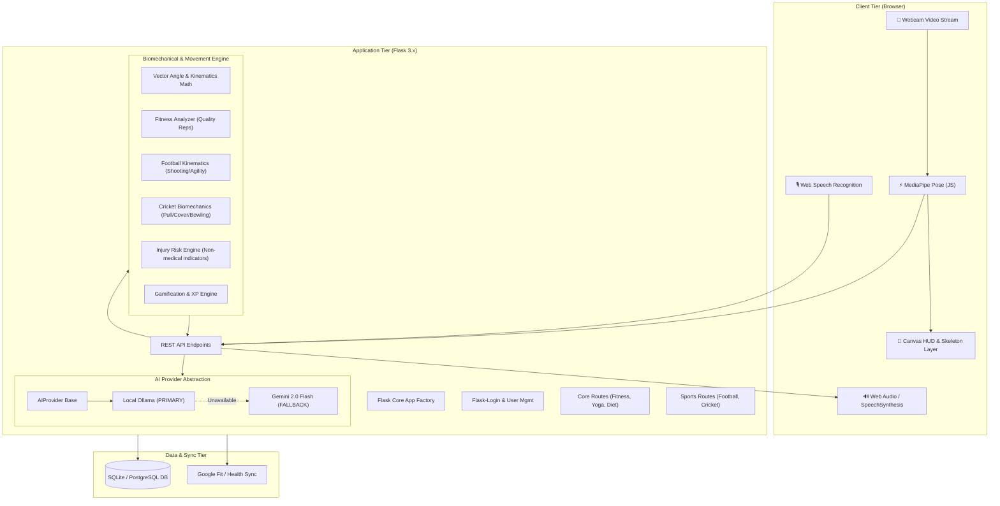

# Kinesis AI — Technical Architecture

---

## 1. Biomechanical Kinematics Engine
* Built with pure NumPy and deterministic trigonometric formulas (`calculate_angle`, `calculate_symmetry`, `calculate_stability`).
* Zero LLM invocation during real-time 30 FPS video tracking ensures sub-15ms response latency on basic laptops without GPU requirements.

---

## 2. Privacy-First AI Layer
* Primary: Local Ollama instance listening at `http://localhost:11434`.
* Transparent Fallback: If Ollama returns a connection error, `AIProvider` automatically falls back to the Gemini Cloud API using the server-side `GOOGLE_API_KEY`.
* Security: API keys and server credentials are never sent to the client browser.

---

## 3. Data Storage & PostgreSQL Readiness
* Relational database using SQLAlchemy models:
  * `User`: Profiles, XP, levels, login streaks.
  * `Workout`: Fitness repetitions, quality reps, duration, form score, estimated calories.
  * `SportsSession`: Football & cricket scores, component breakdowns, style inspiration.
  * `InjuryRiskRecord`: Movement-risk indicators and non-medical athletic guidance.
  * `Achievement`: Gamification badges unlocked by form excellence.
  * `TrainingPlan`: AI-generated position-specific 4-week training schedules.
