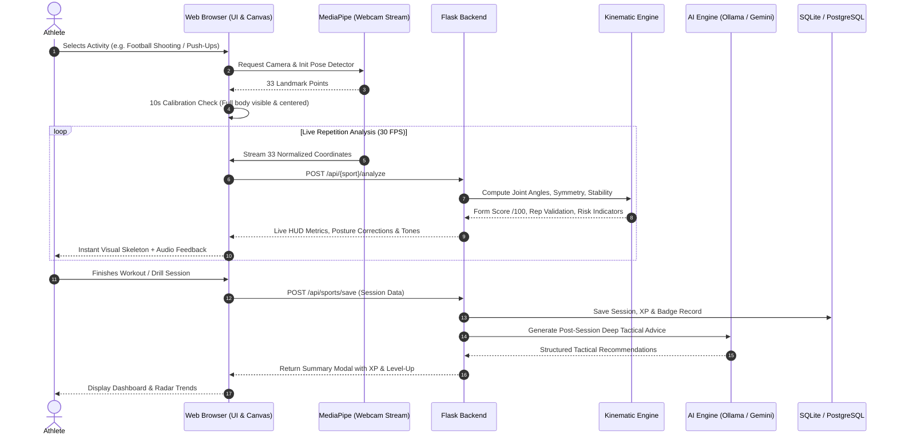

# Kinesis AI — User Journey & System Workflow

---

## The 5-Stage Intelligence Cycle in Detail

### 1. SENSE
The browser requests standard camera access (640x480 resolution). MediaPipe extracts 33 body keypoints with `x, y, z` normalized coordinates and visibility probabilities.

### 2. PREDICT
The client sends coordinate vectors to the Flask backend, where deterministic mathematical calculations measure:
* Joint Angles (vectors around vertices)
* Segment Symmetry (Left vs Right differential)
* Spatial Stability (variance across sliding frames)
* Movement-Risk Index (deviation from safe athletic corridors)

### 3. OPTIMIZE
When an athlete generates a training plan or asks for nutrition coaching, the backend invokes the local Ollama LLM (e.g. `gemma3:4b`) to structure a progressive 4-week periodized program. If Ollama is offline, the system seamlessly uses the Google Gemini 2.0 Flash API.

### 4. ASSIST
During live practice, the athlete receives instant multi-sensory feedback:
* **Visual:** Cyber-glow skeleton lines, real-time score badges, and guidance text.
* **Audio:** High/low confirmation audio tones for quality repetitions and spoken bilingual coaching cues.

### 5. MONITOR
All session metrics, quality rep ratios, and movement-risk histories are consolidated on the athlete dashboard with Chart.js radar and time-series charts.
